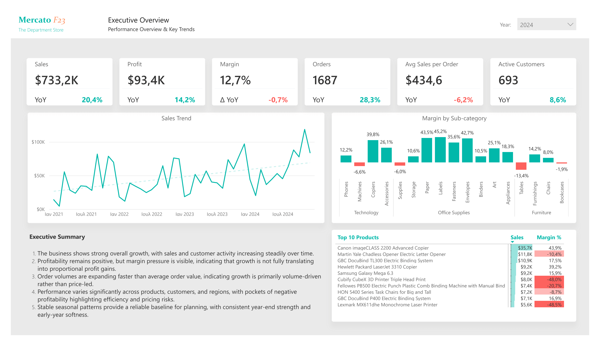

# Mercato F23 - Retail Sales Performance & Customer Insights (Power BI)

This project analyzes multi-year retail sales performance for **Mercato F23**, a fictional department store, using the Tableau *Sample Superstore* dataset adapted for portfolio use.

The dashboard explores sales growth, profitability, product mix, geographic performance, customer value, and seasonal patterns, with a focus on identifying structural risks and performance drivers rather than short-term fluctuations.

The report is built in **Power BI**, using a clean star-schema data model, DAX measures, and executive-oriented visual storytelling.

## Dashboard Preview

👉 [View Printable Report (PDF)](MercatoF23_RetailPerformance_Report.pdf)
👉 [Download Power BI File (PBIX)](MercatoF23_RetailPerformance.pbix)  

## Project Structure

- **PBIX file** – Full interactive Power BI report  
- **PDF report** – Printable, static version  
- **PNG screenshots** – Page-by-page dashboard previews  
- **README** – Executive summary, key insights, and methodology  

## Files

- [MercatoF23_RetailPerformance.pbix](files/MercatoF23_RetailPerformance.pbix)
- [MercatoF23_RetailPerformance_Report.pdf](files/MercatoF23_RetailPerformance_Report.pdf)

All dashboard screenshots are stored in the `images` folder.

## Executive Summary

### Objective

Assess overall retail performance across products, customers, and regions to identify growth patterns, profitability risks, and stable seasonality signals that support informed commercial decision-making.

### Key Findings

- The business demonstrates strong and sustained growth, with increasing sales and customer activity over time.
- Profitability remains positive overall, but margin pressure indicates that revenue growth does not always translate into proportional profit gains.
- Growth is primarily volume-driven, as order counts expand faster than average order value.
- Performance varies widely across products, customers, and regions, with pockets of negative profitability highlighting pricing, discounting, and mix inefficiencies.
- Seasonal demand patterns are stable and repeatable, with consistent year-end strength and early-year softness, providing a reliable baseline for planning.

## Dashboard Overview

The dashboard is organized into the following analytical sections:

1. **Executive Overview**  
   High-level KPIs, multi-year trends, and category margin context, supported by an integrated executive summary.

2. **Product Details**  
   Sales and profitability analysis by category and sub-category, highlighting loss-making items, margin dispersion, and product mix imbalances.

3. **Geography**  
   Regional, state, and city-level performance, revealing uneven profitability across locations and identifying structurally underperforming areas.

4. **Customer Details**  
   Customer value and concentration analysis, including profitability dispersion and dependency on top customers.

5. **Trends & Seasonality**  
   Long-term sales trends and recurring seasonal patterns, separating structural growth from predictable demand cycles.

## Tools & Techniques

- **Power BI Desktop**
- **Power Query** – data cleaning, locale handling, date transformation
- **DAX** – KPIs, YoY metrics, moving averages, customer concentration metrics
- **Data modeling** – star schema with fact and dimension tables
- **Visual design** – executive dashboards, insight-driven layout, custom tooltips
- **Analytical focus** – profitability quality, concentration risk, seasonality stability

## Dataset Source

Tableau Public Dataset:  
**“Sample Superstore”** (CSV version)

- Synthetic retail dataset provided for educational use  
- Original dates shifted to reflect a recent multi-year period  
- Raw data not redistributed  

**Disclaimer:**  
Mercato F23 is a fictional retail entity created exclusively for educational and portfolio demonstration purposes.

## Portfolio Context

This project is part of my **Business Intelligence portfolio**, demonstrating end-to-end BI delivery - from data modeling and DAX to executive storytelling and dashboard design.

👉 More projects: https://kzanalytics.com
